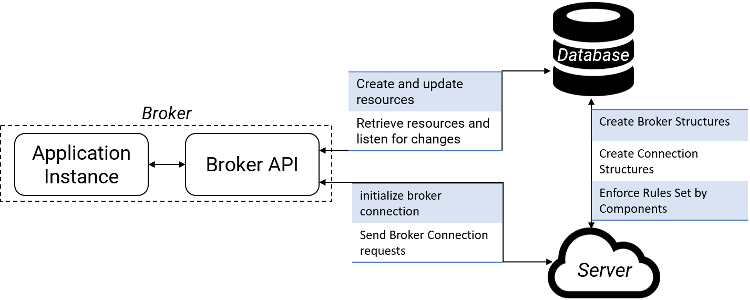

# Broker Graph JS Architecture

The diagram above shows a high-level architecture of the relationships between application instances using the Broker API, the server, and the database. The server handles the registration of default application relays, initialization of Broker instances, routing of relay requests, and enforces propagation rules. The abstractions described in [Broker Graph Concepts](CONCEPTS.md) (i.e., relays, applications, brokers, and connections), are mapped to data structures stored in the database. The diagram below shows the relationships between them.

All data structures have an identifier called a Broker Relay Locator (BRL), a Universal Relay Locator (URL) that encodes the server address (i.e., hostname), the type of data structure (e.g., Broker, Application), and a unique identifier:

**Broker Relay Locator (BRL)** = [hostname] + [path/to/relay]

`(e.g., https://brokergraph.test/relay/app_name/unique_id)`

The path that follows the server hostname in the BRL also describes the relays location in the database. If the server receives an http get request (e.g., if a BRL is entered into a web browser directly), the server will retrieve the relay referenced and redirect to the relay’s value field. This functionality makes it possible to share Broker Relays with applications not connected to the Broker Graph.

## Implementation

All the code was written in Node.js. The system uses:

- Socket.io (http://socket.io) for bidirectional communication.
- Express.js (https://expressjs.com/) for routing HTTP requests.
- Firebase Realtime Database (https://firebase.google.com/docs/database) for database operations.
- Firebase Authentication (https://firebase.google.com/docs/auth) for account authentication.