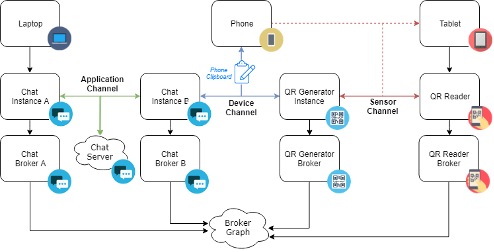
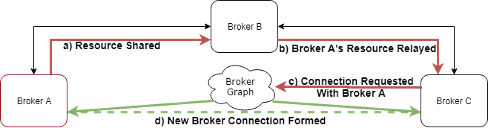
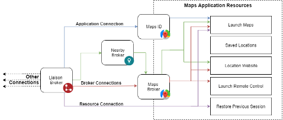

# Broker Graph Concepts

There are many options for sharing digital resources (i.e., pictures, articles, etc.) between internet connected devices. The digital location (URL) of a digital resource can be saved on shared storage services (e.g., Dropbox, OneDrive), sent via a messaging application (e.g., email, SMS), transmitted using an application that harnesses a device's sensor-based capabilities (e.g., AirDrop, NFC), or communicated using a seemingly endless selection of other techniques.

While users have many resource sharing options to choose from, **choosing between sharing techniques is difficult**. There exists no one-size-fits-all approach to sharing digital resources across devices. Each technique provides a particular user experience, which may or may not be suitable for a given scenario. User's must consider constraints such as device capabilities, which applications the devices are running, which user accounts are setup and available on each device, and which "walled garden" each relevant device, application, and file inhabits.

The goal of the Broker Graph is to improve sharing by helping users understand the patchwork of communication channels that exist between the devices in their environment, while minimizing added developer costs. This is achieved by creating a unified standard for flexibly describing the communication channels between applications and the resources (i.e., URLs) shared between them. The result is a graph data structure that encodes the relationships between and within software and hardware ecosystems. The Broker Graph was inspired by social networking platforms (e.g., Facebook, Twitter) that capture complex networks of social relationships and interactions in a machine-readable format. These platforms analyze users’ explicitly specified relationships (e.g., friends, follows) to curate massive amounts of digital content. Similarly, the Broker Graph encodes the communication channels between application instances and allows any internet connected application to share resources, register connections to other applications, and query the collection of resources shared by connected applications. Notably, this approach scales as the complexity of the web of digital relationships increases.

The following sections describe the structures and concepts that make up the Broker Graph.

## Broker Relays

A Broker **Relay** is the base unit exchanged in the Broker Graph. A Broker Relay consists of an ID, which refers to a unique location on the Broker Graph server, metadata, which describes the relays purpose, and value, which is a URL that refers to a digital resource. A **digital resource** can refer to any digital entity that can be obtained over the web (e.g., media, application, operation). The resource content is hosted by the source application. Thus, Broker Relays are proxies that point to application content, similar to the URLs generated by link shortening services (e.g., bitly, TinyURL). What differentiates Broker Relays is that they can be dynamically updated and chained together.

### Dynamic Updates

A Broker Relay’s value and metadata can be dynamically changed. This is valuable to developers who want to share resources associated with an active application instance. For example, a Map application might share a Relay that references the current viewport position. When a user changes their position on a map using the Map application's interface, the application can update the Relay URL and metadata so that the new location is reflected. These changes are automatically propagated to any application this Relay was shared with, so whenever a user considers a representation of a Relay, they will see the most up-to-date information, which can improve their ability to discover and effectively compare resources. This level of control allows application developers to share concepts (e.g., currently playing song) as well as traditional, static content (e.g., pictures).

Relays can also be defined with behaviors that are enforced by the Broker Graph, independent of the source application instance. For example, if the Map application is closed or disconnected, the Relay that described the current location is no longer relevant and can mislead users. Developers can specify a Relay such that whenever the application closed it updates its metadata to indicate that that the current view was from a previous session, the device and time of that session is visualized. In this way, developers can create applications and resources that stay up-to-date and developers do not have to bear the overhead of updating obsolete resources every time a change is made external to the application. Developers thus have greater control over the user experience in external applications that leverage their resources.

### Chaining Relays

When an application shares a resource with an external application, the external application can be given control over how that resource can propagate. For instance, a picture shared by Bill to Sally via email may be downloaded by Sally and then later shared with all of Sally’s devices using a synchronized storage service. The Broker Graph encapsulates this operation by allowing Broker Relays’ to set their value to other Broker Relays. While the value and metadata of the root relay cannot be changed, relay metadata can be appended. Each Broker Relay in a chain can add additional metadata, describing its role in propagating the digital resource referenced by the root Broker Relay.

Relay information can also help users understand the origin of resources (i.e., the application that created the resource and any applications used to communicate to the current application). While a URL describes the original source (i.e., hostname) and type (e.g., image) of a resource, it does not contain information about the path the resource took from source to destination. Understanding the path or paths a resource has taken is important due to the multitude of physical and digital communication channels that can be used to distribute resources (e.g., a resource may have been sent through a chat application, detected via Bluetooth, synchronized through a shared folder, or transmitted through a chain of such techniques). Knowing which communication channel a resource was received through can help users better understand the resources they have available, especially if there is a delay between gaining access to a resource and interpreting it. For example, Dale may have received a picture by bumping phones with a friend, then saved the resource to Google Drive so that it could be later retrieved on his other Google connected devices. When Dale later sees the picture when browsing through Google Drive, if the picture indicates that it was received from his friend via Bump, it may help him remember why he saved the picture in the first place. Alternatively, if Dale was searching for that specific picture but only remembered that he bumped with his friend to receive it, he could use the Bump application as a filter to find it.

## Applications and Brokers

An application is a piece of software created to perform a specific task or collection of tasks for the benefit of a user. An application instance refers to the application code that is running on a device. An application can have multiple instances running across many devices. These instances can work together to create a unified experience or be completely independent. For example, a multiplayer game application might have an instance running on a server that manages the state of multiple clients, while a camera application may have multiple uncoordinated instances that are self-contained.

In the Broker Graph, an application is a structure that describes a source of resources. All Broker Relays belong to an application; however, applications do not create resources, their instances do. When an application instance connects to the Broker Graph through the Broker API, a new Broker is created. This new Broker represents how the application creator envisions this instance will interact with other applications in the environment. Brokers can share and receive resources through connections with other applications and their Brokers. To form these connections, the API requires an identifier for a target component within the Broker Graph. These identifiers are specified via existing communication channels or Broker Connections.

## Communication Channels

A communication channel is a method for propagating information from one digital entity to another, e.g., a user can dictate a URL to another user so they can input it on their device, or a message can pass through multiple servers. Rather than create new communication channels, the Broker Graph encodes the application relationships that the communication channels represent. Borrowing terminology from ego network analysis [27], these application relationships can then be used to facilitate the creation of additional communication via brokerage with other Brokers.

To illustrate how the Broker Graph facilitates the creation of new communication channels through brokerage, consider the diagram above, which has four application instances (i.e., Chat Instance A, Chat Instance B, QR Generator Instance, QR Reader) spread across three devices (i.e., Laptop, Phone, Tablet). In this scenario, three different communication channels exist between the application instances (i.e., Application Channel, Device Channel, Broker Channel). The chat instances on the laptop and phone communicate through the chat application’s server. Any resource received by the phone’s chat instance can be communicated through the clipboard utility to other applications installed on the device, such as the QR Code Generator Application. Although there is no existing digital communication channel between the phone and the tablet, a sensor channel can be created by using the QR Generator instance to encode a resource as a QR code. This QR code can then be read using the QR Code Reader application running on the tablet. In this example, there is no direct connection between the laptop and the tablet, but both have application instances that can communicate with the phone. Thus, a resource from the laptop can reach the tablet via the phone using a combination of application, device, and sensor channels. The Brokers representing these instances in the Broker Graph facilitate this brokerage process so that this pathway can be used to establish communication channels with other application instances.

The above flow chart demonstrates how Brokers A and C can form a new connection in the Broker Graph, given a mutual connection to Broker B: (a) Broker A shares a resource with Broker B; (b) Broker B has a resource from Broker A through a previously established Broker connection, which it relays to Broker C; (c) Broker C uses the shared Broker A ID from Broker B to request a new Broker connection via the Broker Network; (d) If the connection is valid, a new Broker connection is formed and resources from both brokers are exchanged.

## Broker Connections

Broker Connections are a specialized form of communication channels that determine how shared resources can propagate through the Broker Graph. The resources a Broker can access through the Broker Graph are determined by the connections the Broker has formed. To form a connection, a Broker first needs to have a reference ID to a target within the Broker Graph. Brokers can form three types of connections based on the target component: application, resource, and broker. A Broker’s relationship with an application is a combination of all three connection types. The diagram below shows an example of a Broker that has formed all three connection types.

### Broker-Application Connections

An application connection is the easiest to establish. All that is required is the application domain name (e.g., “www.maps.com”). When a connection is formed with an application, Brokers gain access to a fixed set of default resources that describe shortcuts into the application. A shortcut is a resource used to reference the location of executable application code. Most applications have default shortcuts that can be used to launch the application on any device through a web browser. For example, a maps application might provide a shortcut resource that points to “http://maps.com”. This resource could be used by a home screen application that helps users organize their favorite applications. The application might also have an shortcut that can launched with optional address, encoded as a URL template (http://maps.com/address/{address value}). For example, a resource could be used by a Contacts application that offers the option to open a contact’s address externally. As both Brokers and Broker Relays include a reference to their source application, every connection type includes the application's default resources. Application developers may want to automatically form connections with a set of applications they think users are likely to benefit from. Many current web applications integrate similar functionality in the form of shortcuts to popular sharing platforms.

### Broker-Broker Connections

A connection between Brokers represents a connection between application instances. Such connections are difficult to form because the digital addresses of both Brokers are dynamically generated. Each Broker manages a set of resources relevant to the application instances it represents. Brokers can define rules that restrict other Brokers’ abilities to connect to them or specify which of the resources that they manage are shared over a connection. Once a connection is formed, participating Brokers get access to a set of resources that are shared based on rules defined by each Broker. Connecting to different Brokers from the same application instance can result in access to different resources. It is up to application developers to determine which resources to expose based on the target application and communication channel used to establish the connection.

### Broker-Resource Connections

Awareness is equivalent to access in the Broker Graph. Thus, given the ID of a Broker Relay, a Broker can connect to that resource and its source application. As detailed in the Broker Relay section, Broker Relay parameters are dynamic. Thus, a persistent connection is required to monitor changes.

## Context

Users already have access to a large selection of approaches for sharing resources across devices. Rather than replace or compete with these existing approaches, the Broker Graph’s purpose is to make it easier for these techniques to be used in concert, allowing users to choose between and combine techniques. Available cross-device sharing techniques largely focus on encoding elements of context. By context, we refer to the definition specified by [Anind Dey](https://doi.org/10.1007%2Fs007790170019): "any information that can be used to characterize the situation of entities." Sharing techniques can be divided into 3 broad categories of context: physical state, user identity, and activity. In our preliminary observations of users working with Broker Graph connected applications, we found that resources shared through applications in different categories had higher informative value (e.g., Sharing GPS and Chat was more informative than Facebook & Chat).

### User Identity

The term “sharing” has only recently begun to incorporate digital entities such as devices and applications. Sharing has traditionally targeted people and not technology they use. This remains true in software. For example, when someone sends an email to another user, that message is shared with all the receiving user’s devices. While this operation is generally desirable, it lacks precision in scenarios where devices are shared between users. Moreover, users tend to have multiple digital identities, and associate contacts, spread across emails, phone numbers, and applications.

### Physical Property

A vast amount of research has studied how real-world properties can be encoded to facilitate sharing. Mobile devices are fitted with arrays sensors that resemble, and often surpass, our own innate senses. For instance, NFC tags can be “touched”, QR codes can be “seen”, and Bluetooth signals can be “heard”. These applications can be categorized into coordinated and asymmetrical. Coordinated applications (e.g., bump, gps) rely on a central entity (e.g., server) to associate sensor input. Asymmetrical applications (e.g., NFC, QR, Audio) do not require the involvement of another entity, or even an internet connection. These techniques involve the sending party transforming digital content into some real-world artifact (e.g., QR code, ultrasonic signal) and having the second party interpret that artifact.

### Application Activity

The final category of context is sharing through a shared activity. The common context in these applications is that the users have a shared activity (e.g., editing the same text document, playing a multiplayer game). These applications have traditionally had to implement their own sharing mechanisms. With the Broker Graph, all an application developer has to do is share a Broker Relay that references an application instance and the process of associating other users and devices will be offloaded to Liaison. These applications also benefit physical and identity-based sharing applications by sharing resources from connected instances.